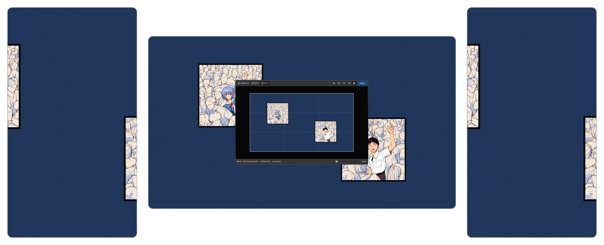
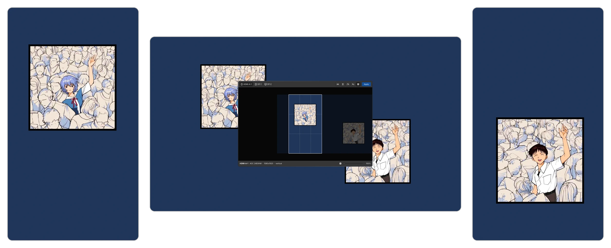
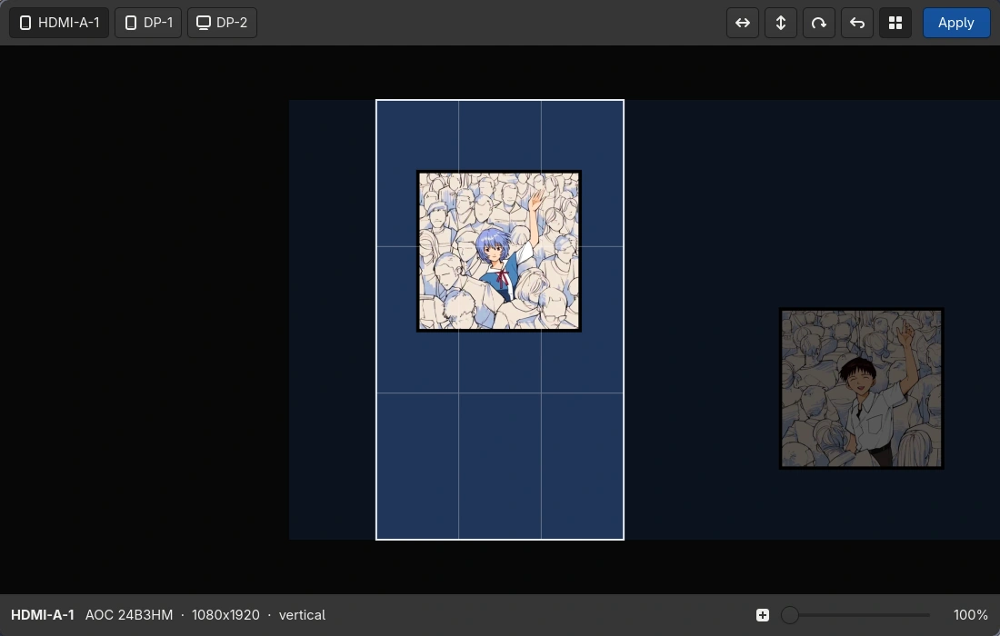

# wallframe

Drag, zoom, mirror and rotate your wallpaper inside each monitor's frame. A GTK4 editor for awww and swww on Wayland.

Wallpaper daemons scale the image to fill the screen and cut off the parts that do not fit. They always keep the center. On a portrait monitor, a landscape image can lose more than half of its width, and often the part you wanted to see. wallframe shows the frame of each monitor over the image, so you can choose which part to keep.

**Before:** the daemon keeps the center, so the portrait monitors cut off the characters.



**After:** each monitor framed by hand with wallframe.



## Requirements

`gtk4`, `python-gobject`, `python-cairo`, `python-pillow`, and `awww` or `swww`. On Arch Linux:

```bash
sudo pacman -S gtk4 python-gobject python-cairo python-pillow awww
```

Optional:

- Hyprland or sway: wallframe opens on the focused monitor and shows the model of each monitor.
- `libnotify`: errors appear as notifications, which helps when you start wallframe without a terminal. On Hyprland, errors appear as Hyprland notifications even without it.

## Install

Clone the repository and run it. There is nothing to build:

```bash
git clone https://github.com/AlejandroMinor/wallframe.git
cd wallframe
./wallframe
```

To run it from anywhere as `wallframe`, link it into a folder in your `PATH`:

```bash
ln -s "$PWD/wallframe" ~/.local/bin/wallframe
```

## Usage



| Action | Mouse / button | Key |
|--------|----------------|-----|
| Move | Drag | |
| Zoom | Scroll or slider | |
| Mirror / flip / rotate 90° | Toolbar | `H` / `V` / `R` |
| Reset to the original image, centered | Toolbar | `0` |
| Rule-of-thirds grid | Toolbar | `G` |
| Next monitor | Monitor buttons | `Tab` |
| Apply to the marked monitors | Apply | `Enter` |
| Close | | `Esc` |

A dot on a monitor button means that the monitor does not show your changes yet. Apply crops the image to the exact size of the monitor and sets it with awww (or swww) on that monitor only. The window stays open.

wallframe saves the crops in `~/.local/share/wallframe/`. It does not use the cache folder, because the daemon loads the crops from there again at login. When you open wallframe again, each monitor starts from the original image with your last framing, so the image does not lose quality. Animated and video wallpapers are not supported.

wallframe opens on the focused monitor. To start on a different monitor, give its output name: `wallframe DP-1`.

## Development

The tests cover the framing math. They do not need a display or a wallpaper daemon:

```bash
python -m venv --system-site-packages .venv
.venv/bin/pip install pytest
PYTHONPATH=src .venv/bin/pytest
```

## License

GPL-3.0-or-later. See [LICENSE](LICENSE).
