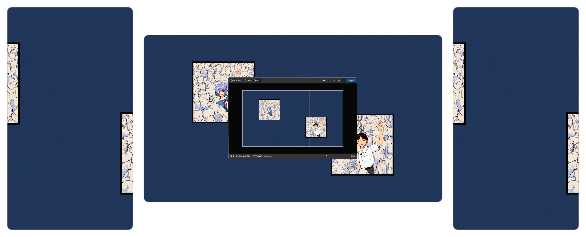
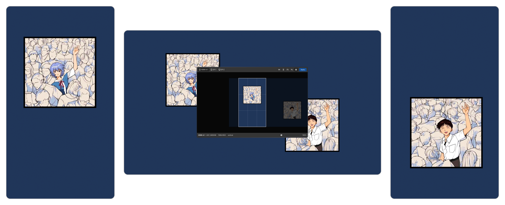

# wallframe

Drag, zoom, mirror and rotate your wallpaper inside each monitor's frame. GTK4 editor for awww and swww on Wayland.

Wallpaper daemons fill the screen by scaling the image and cropping what overflows, always around the centre. On a portrait monitor a landscape image loses more than half its width that way, often the half that mattered. wallframe shows each monitor's frame over the image and lets you place it by hand.

**Before:** the daemon crops around the centre, cutting the characters on the portrait monitors.



**After:** each monitor framed by hand with wallframe.



## Usage

```bash
./wallframe.py
```

| Action | Mouse / button | Key |
|--------|----------------|-----|
| Move | drag | |
| Zoom | scroll, slider | |
| Mirror / flip / rotate 90° | toolbar | `H` / `V` / `R` |
| Reset to the original, centred | toolbar | `0` |
| Rule-of-thirds grid | toolbar | `G` |
| Next monitor | monitor buttons | `Tab` |
| Apply the marked monitors | Apply | `Enter` |
| Close | | `Esc` |

A dot on a monitor button means the framing differs from what that monitor shows. Apply crops the image to the exact output size and sets it with awww (or swww) on that monitor only; the window stays open.

Crops are saved in `~/.local/share/wallframe/` (not in the cache: the daemon reloads them from there at login). Reopening wallframe resumes each monitor's framing from the original image, so it never crops a crop. Animated and video wallpapers are skipped.

wallframe opens on the focused monitor. To start on another one, pass its output name: `./wallframe.py DP-1`.

## Requirements

`gtk4`, `python-gobject`, `python-cairo`, `python-pillow`, and `awww` or `swww`.

Optional: Hyprland or sway, to open on the focused monitor and show each monitor's model; `libnotify`, to show errors as notifications when launched without a terminal.

## License

GPL-3.0-or-later. See [LICENSE](LICENSE).
