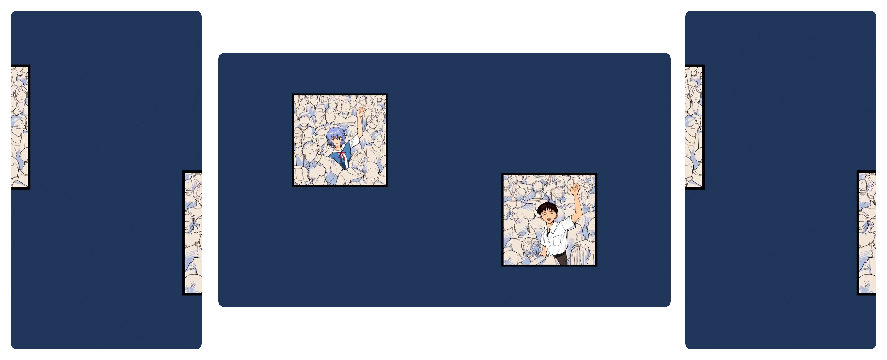
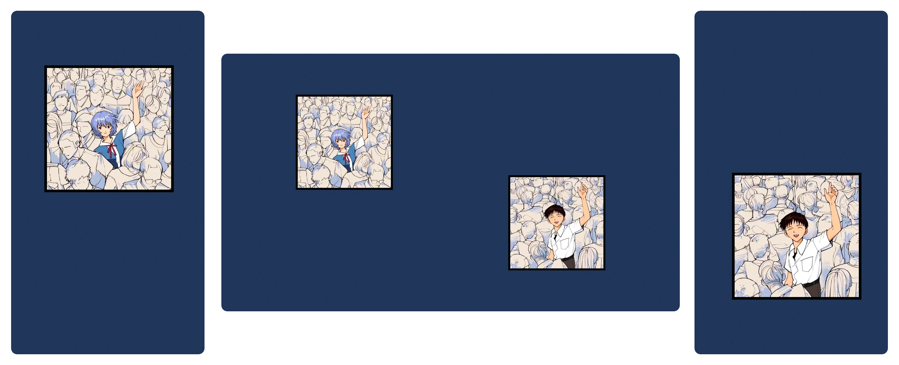
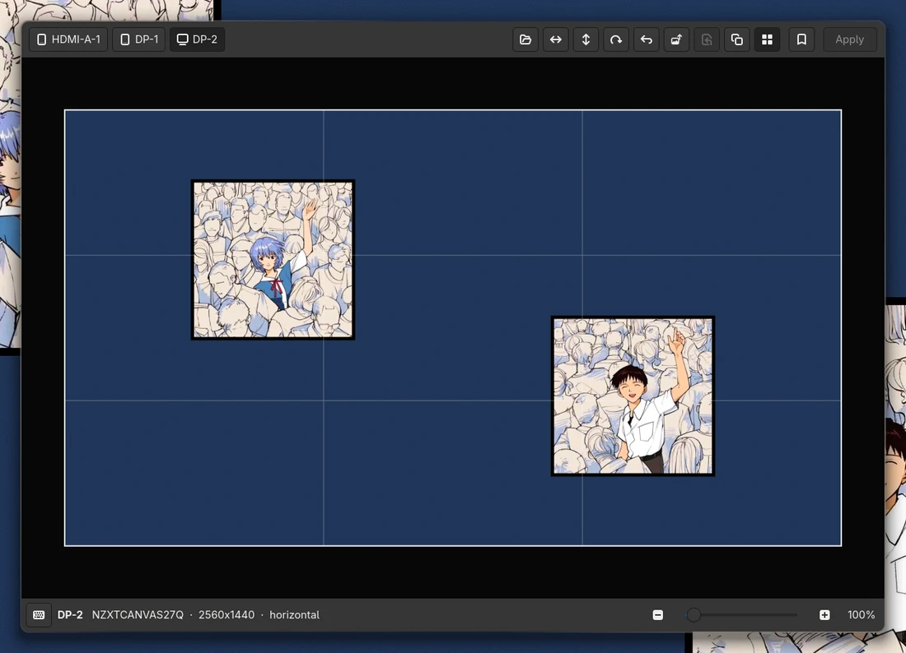
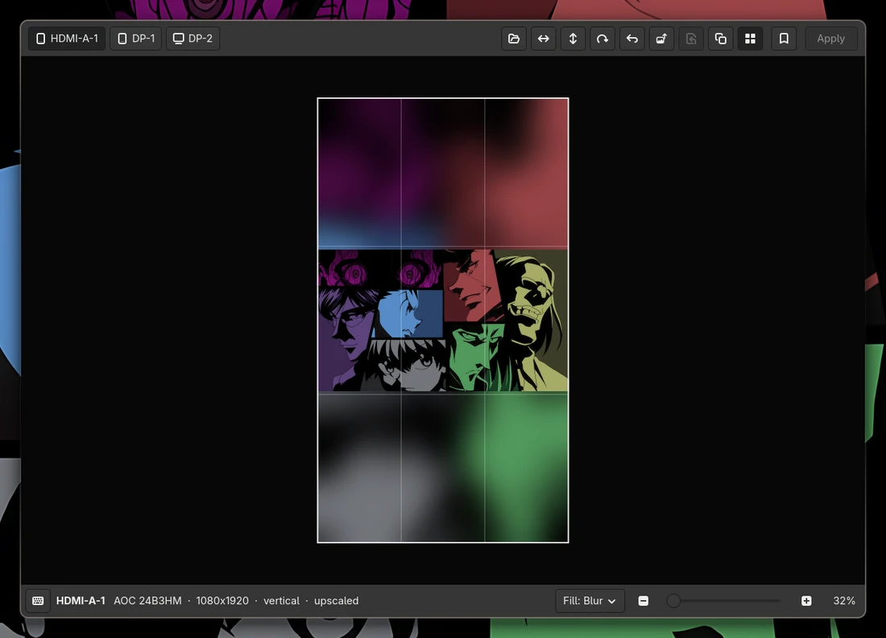
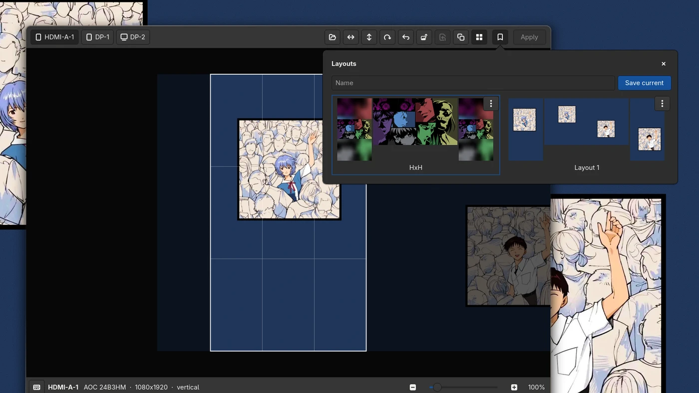

# wallframe

Drag, zoom, mirror and rotate your wallpaper inside each monitor's frame, or one picture across all of them, and save layouts for all your monitors. A GTK4 editor for awww and swww on Wayland.

Wallpaper daemons scale the image to fill the screen and cut off the parts that do not fit. They always keep the center. On a portrait monitor, a landscape image can lose more than half of its width, and often the part you wanted to see. wallframe shows the frame of each monitor over the image, so you can choose which part to keep.

**Before:** the daemon keeps the center, so the portrait monitors cut off the characters.



**After:** each monitor framed by hand with wallframe.



## Requirements

One of these, on Wayland:

- A compositor that awww or swww runs on: Hyprland, sway, niri, river, Wayfire and the like. It is tested on Hyprland.
- KDE Plasma 6. Plasma draws its own wallpaper, so wallframe sets it through Plasma, one per screen, without awww. `kscreen-doctor`, part of Plasma, gives each screen its output name, scale and place. Tested on Plasma 6.7.

GNOME does not work: it shows one wallpaper across all monitors, and awww cannot draw one there.

It needs GTK 4.10 or newer, PyGObject, pycairo and Pillow, and outside Plasma, awww or swww.

**Arch Linux.** Everything is in the official repositories. On Plasma, leave out `awww`:

```bash
sudo pacman -S gtk4 python-gobject python-cairo python-pillow awww
```

**Fedora:**

```bash
sudo dnf install gtk4 python3-gobject python3-cairo python3-pillow
```

**Debian 13 or newer, Ubuntu 24.04 or newer.** Debian 12's GTK is too old:

```bash
sudo apt install gir1.2-gtk-4.0 python3-gi python3-gi-cairo python3-pil
```

Fedora, Debian and Ubuntu do not package awww or swww. On their Plasma editions nothing else is needed; with Hyprland, sway and the like, build awww from [its source](https://codeberg.org/LGFae/awww).

Optional:

- Hyprland or sway: wallframe opens on the focused monitor and shows the model of each monitor.
- [Upscayl](https://github.com/upscayl/upscayl): the **Upscale** panel enlarges low-resolution images ×2, ×3 or ×4 before cropping, on one monitor or all of them at once. You can compare the result with the original at real size, and go back to the original at any time. It needs a Vulkan GPU, and the native package: on Arch, `upscayl-bin` from the AUR; elsewhere, the official .deb or .rpm. The Flatpak and AppImage do not work.
- `libnotify`: errors appear as notifications, which helps when you start wallframe without a terminal. On Hyprland, errors appear as Hyprland notifications even without it.

## Install

Clone the repository and run it. There is nothing to build:

```bash
git clone https://github.com/AlejandroMinor/wallframe.git
cd wallframe
./wallframe
```

To run it from anywhere as `wallframe`, link it into a folder in your `PATH`:

```bash
ln -s "$PWD/wallframe" ~/.local/bin/wallframe
```

To find it in your app launcher, with its icon in the taskbar instead of the generic Wayland one, link its desktop file and icons too:

```bash
ln -s "$PWD/data/io.github.AlejandroMinor.wallframe.desktop" ~/.local/share/applications/
mkdir -p ~/.local/share/icons/hicolor/scalable/apps ~/.local/share/icons/hicolor/symbolic/apps
ln -s "$PWD"/src/wallframe/icons/hicolor/scalable/apps/*.svg ~/.local/share/icons/hicolor/scalable/apps/
ln -s "$PWD"/src/wallframe/icons/hicolor/symbolic/apps/*.svg ~/.local/share/icons/hicolor/symbolic/apps/
```

### Open as a floating window

wallframe works best as a floating window, centered on the screen. Add a rule for its app ID, `io.github.AlejandroMinor.wallframe`.

Hyprland:

```lua
hl.window_rule({
    name   = "wallframe",
    match  = { class = "^(io.github.AlejandroMinor.wallframe)$" },
    float  = true,
    center = true,
})
```

sway:

```
for_window [app_id="io.github.AlejandroMinor.wallframe"] floating enable
```

## Usage



| Action | Mouse / button | Key |
|--------|----------------|-----|
| Move | Drag | Arrows (`Shift` for bigger steps) |
| Zoom | Scroll, slider or `−` / `+` buttons | `+` / `-` |
| Center, keeping the zoom | | `C` |
| Move the background instead of the image | Fill panel | `B` |
| Mirror / flip / rotate 90° | Toolbar | `H` / `V` / `R` |
| Reset to the original image, centered | Toolbar | `0` |
| Open another image for this monitor | Toolbar, or drop a file on the canvas | `O` |
| Discard changes since the last Apply | Toolbar | `D` |
| Copy from another monitor: everything, or just the fill | Toolbar | |
| Rule-of-thirds grid | Toolbar | `G` |
| Save or switch layouts | Layouts button | |
| Next monitor, or the span | Monitor buttons | `Tab` |
| Arrange the monitors of the span as on your desk | Toolbar, in the span | `M` |
| Apply to the marked monitors | Apply | `Enter` |
| Show all keyboard shortcuts | Keyboard button, bottom left | `?` / `F1` |
| Close | | `Esc` |

Zoom below 100% to see more of the image, or to make it smaller than the monitor. The empty space around it is filled with a copy of the image, blurred as much as you like, or with a color. Both are in the **Fill** panel of the bottom bar. Check **Move background** there (or press `B`) to drag and zoom that copy instead of the image.



A dot on a monitor button means that the monitor does not show your changes yet. Apply crops the image to the exact size of the monitor and sets it with awww (or swww) on that monitor only. The window stays open.

wallframe saves the crops in `~/.local/share/wallframe/`. It does not use the cache folder, because the daemon loads the crops from there again at login. When you open wallframe again, each monitor starts from the original image with your last framing, so the image does not lose quality. Animated and video wallpapers are not supported.

The **Layouts** panel saves what every monitor shows: the picture and its framing. Each layout has a preview of your monitors as they stand on the desk (on Hyprland and sway; elsewhere side by side). Click a layout to show it on the monitors at once; the one they show is marked. Its menu renames it, saves the current wallpapers into it, duplicates it or deletes it. Layouts point at your pictures: if one was moved or deleted, that monitor stays as it was and wallframe says why, with the path where the picture was.



### One picture across all monitors

The **Span** button, after the monitor buttons, frames one picture across every monitor. The canvas shows your monitors where they stand on the desk, each with its own frame, over the picture. Drag, zoom, mirror, rotate, fill and upscale work as on one monitor. Apply gives each monitor its own piece, cropped at its own resolution, so a scaled 4K monitor next to a 1080p one stays sharp and lines up. Where no monitor is, as beside a portrait monitor that stands taller than the others, nothing shows.

Monitors of different sizes and resolutions line up too. wallframe reads each monitor's real size from its EDID, so the picture keeps the same size across a 27" 1440p and a 24" 1080p, and a line that crosses from one to the other does not jump. The status bar says "real sizes" when it could read them all, or "desktop sizes" when it could not. To match how the monitors stand on your desk, higher, lower or apart, press **Arrange** (or `M`) and drag them; they snap to each other's edges, and `0` puts them back.

Span needs to know where the monitors are, so it is there on Hyprland, sway and Plasma, with two monitors or more. A layout saved from the span brings the span back. Editing one monitor on its own takes that monitor out of the span; Apply on the span puts it back.

wallframe opens on the focused monitor, or on the span when the monitors show it. To start on a different monitor, give its output name: `wallframe DP-1`; for the span, `wallframe span`.

## Development

The tests cover everything except the window: framing, cropping, saved state and reading the daemon and compositor output. They do not need a display or a wallpaper daemon. If `node` is installed, the scripts wallframe sends to Plasma also run, against a stand-in for Plasma:

```bash
python -m venv --system-site-packages .venv
.venv/bin/pip install pytest
PYTHONPATH=src .venv/bin/pytest
```

## License

GPL-3.0-or-later. See [LICENSE](LICENSE).
